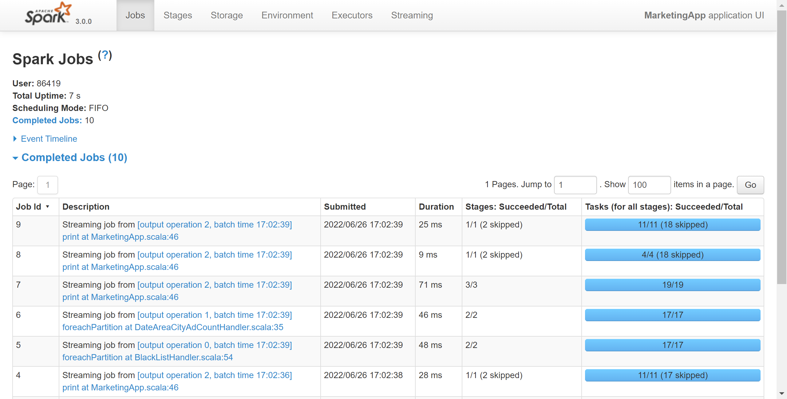
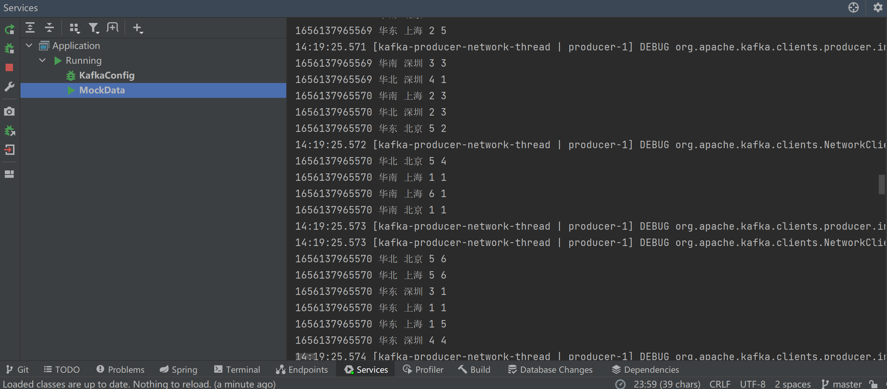
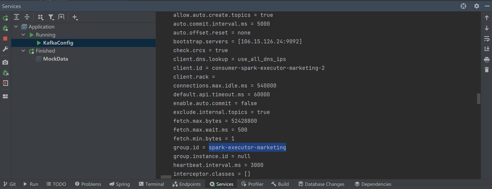
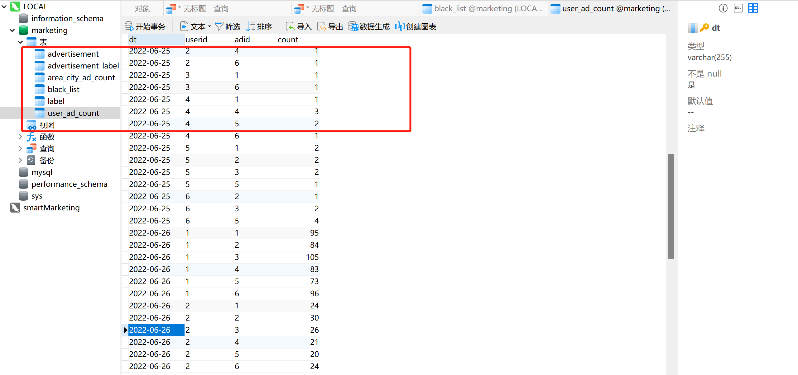
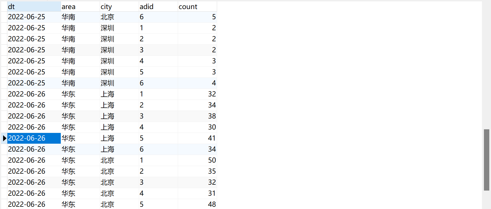

# 广告投放系统 

#### 1. 应用需求描述

广告系统中必不可少的部分是一个实时响应广告请求，并决策广告的投放引擎。一般来说，广告系统的投放引擎采用类搜索的架构，即检索加排序的两阶段决策过程。

在本项目中，我们主要实现了处理广告请求+广告排序+实时广告监测功能，主要流程包括：

> 接受广告前端 Web 服务器发来的请求 —> 解析请求 —> 搜索前预处理 —> 判断有效广告位 —> 记录请求 —> 是否进入搜索 —> 查询用户属性 —> 交易类型判断 —> lucene搜索 —> 构造回调基本信息 —> 封装响应 —> 返回

广告投放机的主要任务是与其他各个功能模块打交道，并将它们串联起来完成在线广告投放决策。同时，我们实现了广告监测功能：

（1）在线反作弊（anti-spam）。实时判断流量来源中是否有作弊流量，并且将这部分流量从后续的计价和统计中去除掉。

（2）在线行为反馈，包括实时受众定向（real-time targeting）和实时点击反馈（realtimeclick feedback）等部分。

由于是学习使用的样例，因此没有真实的数据来源，所以先模拟真实的用户访问行为，将生成的广告日志发送至Kafka ，再通过Kafka进行消费，实现以下功能：

###### 广告黑名单

实现实时的动态黑名单机制，将每天对某个广告点击超过 100 次的用户拉黑。 注：黑名单保存到 MySQL 中。

###### 广告点击量实时统计

实时统计每天各地区各城市各广告的点击总流量，并将其存入 MySQL。

###### 最近一小时广告点击量

实时统计最近一小时的各个广告的点击量。


---

#### 2. 实现思路

###### 广告黑名单：

1）读取 Kafka 数据之后，并对 MySQL 中存储的黑名单数据做校验；

 2）校验通过则对给用户点击广告次数累加一并存入 MySQL；

 3）在存入 MySQL 之后对数据做校验，如果单日超过 100 次则将该用户加入黑名单。

###### 广告点击量实时统计：

1）单个批次内对数据进行按照天维度的聚合统计;

 2）结合 MySQL 数据跟当前批次数据更新原有的数据。

###### 最近一小时广告点击量：

1）开窗确定时间范围； 

2）在窗口内将数据转换数据结构为((adid,hm),count); 

3）按照广告 id 进行分组处理，组内按照时分排序。


---

#### 3. 测试用例及结果截图



##### a. 模拟数据生成

```java
/**
 * 广告日志表
 * @param timestamp 时间戳
 * @param area 地区
 * @param city 城市
 * @param userid 用户ID
 * @param adid 广告ID
 */
```





##### b.广告黑名单



##### c.最近一小时广告点击量



##### d.广告点击量实时统计


##### e.控制台日志归类


#### 4. 程序的主要代码片段

##### a. MarketingApp 主程序

```java
object MarketingApp {

  def main(args: Array[String]): Unit = {

    //1.创建 SparkConf
    val sparkConf: SparkConf = new SparkConf().setMaster("local[*]").setAppName("MarketingApp")

    //2.创建 StreamingContext
    val ssc = new StreamingContext(sparkConf, Seconds(3))

    //3.读取 Kafka 数据
    val kafkaDStream: InputDStream[ConsumerRecord[String, String]] =
      MyKafkaUtil.getKafkaStream("marketingNew", ssc)

    //4.将每一行数据转换为样例类对象
    val adsLogDStream: DStream[AdsLog] = kafkaDStream.map(record => {
      val arr: Array[String] = record.value().split(" ")
      AdsLog(arr(0).toLong, arr(1), arr(2), arr(3), arr(4))
    })

    //5.根据 MySQL 中的黑名单过滤当前数据集
    val filterAdsLogDStream: DStream[AdsLog] =
      BlackListHandler.filterByBlackList(adsLogDStream)

    //6.将满足要求的用户写入黑名单
    //BlackListHandler.addBlackList(filterAdsLogDStream)

    //7.统计每天各大区各个城市广告点击总数并保存至 MySQL 中
    //DateAreaCityAdCountHandler.saveDateAreaCityAdCountToMysql(filterAdsLogDStream)

    //8.统计最近一小时(2 分钟)广告分时点击总数
    val adToHmCountListDStream: DStream[(String, List[(String, Long)])] =
      LastHourAdCountHandler.getAdHourMintToCount(filterAdsLogDStream)

    //9.打印
    adToHmCountListDStream.print()


    //启动任务
    ssc.start()
    ssc.awaitTermination()
  }
}
```

##### b. BlackListHandler

```java
package com.ecnu.smartmarketing.spark.handler

import com.ecnu.smartmarketing.spark.bean.AdsLog

import java.sql.Connection
import java.text.SimpleDateFormat
import java.util.Date
import com.ecnu.smartmarketing.spark.util.JDBCUtil
import org.apache.spark.streaming.dstream.DStream

object BlackListHandler {

  private val sdf = new SimpleDateFormat("yyyy-MM-dd")

  // TODO 判断点击用户是否在黑名单中
  def filterByBlackList(adsLogDStream: DStream[AdsLog]): DStream[AdsLog] = {
    adsLogDStream.transform(
      rdd => {
        rdd.filter(
          adsLog => {
            val connection: Connection = JDBCUtil.getConnection
            val bool: Boolean = JDBCUtil.isExist(connection,
              """
                |select * from black_list
                |where userid =?
                      """.stripMargin
              , Array(adsLog.userid))
            connection.close()
            !bool
          })
      })
  }

  // TODO 如果用户不在黑名单中，那么进行统计数量（每个采集周期）
  def addBlackList(filterAdsLogDSteam: DStream[AdsLog]): Unit = {

    //1.将数据接转换结构,统计当前批次中单日每个用户点击每个广告的总次数
    //  ads_log=>((date,user,adid),1)
    val dateUserAdToOne: DStream[((String, String, String), Long)] =
    filterAdsLogDSteam.map(
      adsLog => {
        val date: String = sdf.format(new Date(adsLog.timestamp))
        ((date, adsLog.userid, adsLog.adid), 1L)
      }
    )

    //2.统计单日每个用户点击每个广告的总次数
    //  ((date, user, adid), 1) => ((date, user, adid), count)
    val dateUserAdToCount: DStream[((String, String, String), Long)] =
    dateUserAdToOne.reduceByKey(_ + _)
    dateUserAdToCount.foreachRDD(
      rdd => {
        rdd.foreachPartition(
          iter => {
            val connection: Connection = JDBCUtil.getConnection
            iter.foreach {

              // TODO 如果没有超过阈值，那么需要将当天的广告点击数量进行更新。
              case ( ( dt, user, ad ), count ) => JDBCUtil.executeUpdate( connection,
                            """
                              |INSERT INTO user_ad_count (dt,userid,adid,count)
                              |VALUES (?,?,?,?)
                              |ON DUPLICATE KEY
                              |UPDATE count=count+?
                            """.stripMargin
                , Array(dt, user, ad, count, count))

                // TODO 判断更新后的点击数据是否超过阈值
                val ct: Long = JDBCUtil.getDataFromMysql(connection,
                            """
                              |select count from
                              |user_ad_count where dt =? and userid =? and adid =?
                            """.stripMargin
                  , Array(dt, user, ad))

                // TODO 如果统计数量超过点击阈值(30)，那么将用户拉入到黑名单
                if (ct >= 30) {
                  JDBCUtil.executeUpdate(connection,
                            """
                              |INSERT INTO black_list (userid)
                              |VALUES (?) ON DUPLICATE KEY update userid =?
                            """.stripMargin
                    , Array(user, user))
                }

            }
            connection.close()
          })
      })
  }


}
```

##### c. DateAreaCityAdCountHandler

```java
package com.ecnu.smartmarketing.spark.handler

import com.ecnu.smartmarketing.spark.bean.AdsLog
import com.ecnu.smartmarketing.spark.util.JDBCUtil
import org.apache.spark.streaming.dstream.DStream

import java.sql.Connection
import java.text.SimpleDateFormat
import java.util.Date

object DateAreaCityAdCountHandler {
  //时间格式化对象
  private val sdf: SimpleDateFormat = new SimpleDateFormat("yyyy-MM-dd")

  /**
   * 统计每天各大区各个城市广告点击总数并保存至 MySQL 中
   *
   * @param filterAdsLogDStream 根据黑名单过滤后的数据集
   */
  def saveDateAreaCityAdCountToMysql(filterAdsLogDStream: DStream[AdsLog]): Unit
  = {
    //1.统计每天各大区各个城市广告点击总数
    val dateAreaCityAdToCount: DStream[((String, String, String, String), Long)] =
      filterAdsLogDStream.map(ads_log => {
        //a.取出时间戳
        val timestamp: Long = ads_log.timestamp
        //b.格式化为日期字符串
        val dt: String = sdf.format(new Date(timestamp))
        //c.组合,返回
        ((dt, ads_log.area, ads_log.city, ads_log.adid), 1L)
      }).reduceByKey(_ + _)
    //2.将单个批次统计之后的数据集合 MySQL 数据对原有的数据更新
    dateAreaCityAdToCount.foreachRDD(rdd => {
      //对每个分区单独处理
      rdd.foreachPartition(iter => {
        //a.获取连接
        val connection: Connection = JDBCUtil.getConnection
        //b.写库
        iter.foreach { case ((dt, area, city, adid), count) =>
          JDBCUtil.executeUpdate(connection,
            """
              |INSERT INTO area_city_ad_count (dt,area,city,adid,count)
              |VALUES(?,?,?,?,?)
              |ON DUPLICATE KEY
              |UPDATE count=count+?;
            """.stripMargin,
            Array(dt, area, city, adid, count, count))
        }
        //c.释放连接
        connection.close()
      })
    })
  }
}
```

##### d. LastHourAdCountHandler

```java
package com.ecnu.smartmarketing.spark.handler

import com.ecnu.smartmarketing.spark.bean.AdsLog

import java.text.SimpleDateFormat
import java.util.Date
import org.apache.spark.streaming.Minutes
import org.apache.spark.streaming.dstream.DStream

object LastHourAdCountHandler {

  private val sdf: SimpleDateFormat = new SimpleDateFormat("HH:mm")

  /**
   * 统计最近一小时(2分钟)广告分时点击总数
   *
   * @param filterAdsLogDStream 过滤后的数据集
   * @return
   */
  def getAdHourMintToCount(filterAdsLogDStream: DStream[AdsLog]):
  DStream[(String, List[(String, Long)])] = {

    //1.开窗 => 时间间隔为 1 个小时 window()
    val windowAdsLogDStream: DStream[AdsLog] =
      filterAdsLogDStream.window(Minutes(2))

    //2.转换数据结构 AdsLog =>((adid,hm),1L) map()
    val adHmToOneDStream: DStream[((String, String), Long)] =
      windowAdsLogDStream.map(
        adsLog => {
          val timestamp: Long = adsLog.timestamp
          val hm: String = sdf.format(new Date(timestamp))
          ((adsLog.adid, hm), 1L)
        }
      )

    //3.统计总数 ((adid,hm),1L)=>((adid,hm),sum) reduceBykey(_+_)
    val adHmToCountDStream: DStream[((String, String), Long)] =
      adHmToOneDStream.reduceByKey(_ + _)

    //4.转换数据结构 ((adid,hm),sum)=>(adid,(hm,sum)) map()
    val adToHmCountDStream: DStream[(String, (String, Long))] =
      adHmToCountDStream.map {
        case ((adid, hm), count) =>
          (adid, (hm, count))
      }

    //5.按照 adid 分组 (adid,(hm,sum))=>(adid,Iter[(hm,sum),...]) groupByKey
    adToHmCountDStream.groupByKey().mapValues(
      iter =>
        iter.toList.sortWith(_._1 < _._1)
    )

  }
}
```

##### e.建表语句

```sql
CREATE TABLE black_list
(
    userid CHAR(1) PRIMARY KEY
);


-- ----------------------------
-- Table structure for user_ad_count
-- ----------------------------

CREATE TABLE user_ad_count
(
    dt     varchar(255),
    userid CHAR(1),
    adid   CHAR(1),
    count  BIGINT,
    PRIMARY KEY (dt, userid, adid)
);

-- ----------------------------
-- Table structure for area_city_ad_count
-- ----------------------------
CREATE TABLE area_city_ad_count
(
    dt    VARCHAR(20),
    area  VARCHAR(100),
    city  VARCHAR(100),
    adid  VARCHAR(20),
    count BIGINT,
    PRIMARY KEY (dt, area, city, adid)
);
```